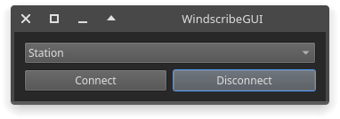

# WindscribeGUI

Qt 5/6 based GUI for Windscribe VPN written in Python



[AUR](https://aur.archlinux.org/packages/windscribegui-git)

#### Installation
Requirements:
- [Python] 3.9 or later
- PyQt5 or PyQt6
```
$ pip install --user pyqt5
$ pip install --user git+https://github.com/shaybox/windscribegui.git

$ windscribegui
```

### Development
Requirements:
- [Python] 3.7 or later
- [Poetry] via pip
- [PyQt5] or [PyQt6]
```
git clone https://github.com/ShayBox/WindscribeGUI.git
cd WindscribeGUI
poetry env use <python3 executable>

$ poetry run windscribegui
```

#### Usage
There's icon and desktop entry files in the `data` directory.  
Run the command `windscribegui -b` to start the tray icon.  
Run the command `windscribegui --help` to see the command line options.

[Python]: https://python.org
[Poetry]: https://python-poetry.org
[PyQt5]: https://pypi.org/project/PyQt5
[PyQt6]: https://pypi.org/project/PyQt6
